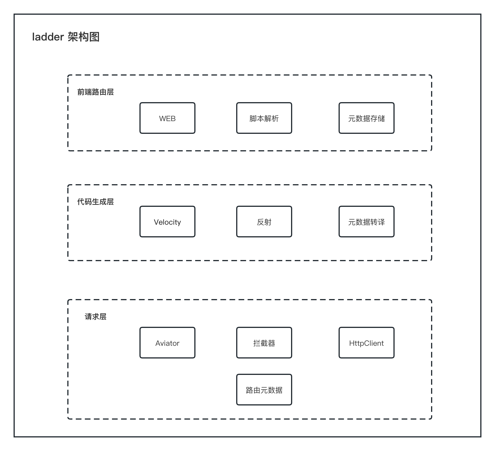

# ladder 是什么
ladder 中文为梯子，这是一个能帮助你简化对接接口流程的自动化映射工具。比如在聚合配送领域，一个聚合厂商通常需要对接几十家的配送平台，每个平台对接成本在一周人天，通过这个工具，可以实现两天对接完成。
# ladder 如何实现
ladder 通过可视化配置，将配置信息持久化到数据库中，利用自研代码生成工具，读取数据库配置信息，生成对应代码，在类中添加注解，实现自动映射。
ladder 自上而下分为三层，详见下图：

# todo list
- [x] 支持字段的某参数来自于另外的请求，比如下单接口的价格来自预估价的响应；比如下单的用户 token 来自于 Redis。